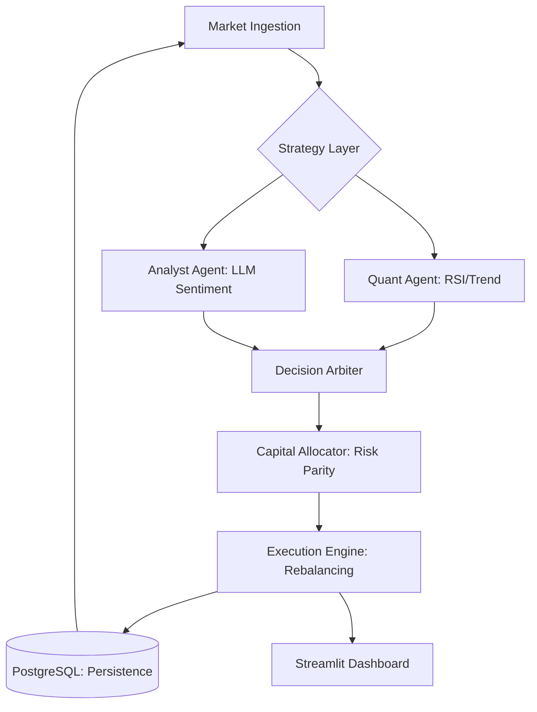

# NexusQuant - Agentic Portfolio Intelligence Platform

NexusQuant is a production-grade, high-fidelity Simulation and LLMops platform. It orchestrates specialized AI agents that collaborate to manage multi-asset trading portfolios by combining Large Language Models (LLMs) with deterministic quantitative finance.

---

## 🏗️ System Architecture
NexusQuant operates on a **Synchronized Portfolio Loop (SPL)**. This architecture decouples high-level strategic sentiment from the mathematical rigor of risk management and execution.

### The Synchronized Portfolio Loop (SPL)


### 🧩 Core Components
- **Advisory Layer**: A hybrid signal generation system.
    - **Quant Agent**: Uses deterministic technical indicators (RSI, EMA) for baseline technical signals.
    - **Analyst Agent**: A Groq-powered LLM that analyzes market context and macro sentiment.
- **Decision Arbiter**: Uses **Exponential Moving Average (EMA) smoothing** and **Signal Hysteresis** to aggregate conflicting advice into a unified sentiment score, preventing rapid oscillators in portfolio state.
- **Risk Core**: Implements **Inverse Volatility Scaling (Risk Parity)** via rolling 20-tick standard deviation to ensure balanced risk exposure.
- **Execution Engine**: A high-precision simulation loop that manages rebalancing, order persistence, and fractional position sizing with sub-pip accuracy.
- **Premium Dashboard**: A Streamlit interface with real-time Plotly visualizations for asset allocation, PnL tracking, and advisor confidence distributions.

---

## ⚡ Performance & Reliability Optimizations
To ensure production readiness and cost-efficiency, NexusQuant implements several advanced optimizations:

### 1. LLM API Call Reduction
- **Intelligent Cooldowns**: Enforces a `LLM_COOLDOWN_TICKS` limit (default 20 ticks) between Analyst calls per asset, preventing redundant API usage during flat market states.
- **State Change Detection**: (Roadmap) Triggering LLM analysis only when market volatility or price delta exceeds specific thresholds.

### 2. Signal Stability & Hysteresis
- **EMA Smoothing**: New signals are blended with historical sentiment to prevent "jittery" trading decisions.
- **Update Hysteresis**: The Arbiter ignores sentiment shifts smaller than 10%, ensuring that only significant outlook changes trigger portfolio rebalancing.

### 3. Execution Efficiency
- **Rebalancing Thresholds**: Trades below a $100 USD delta are ignored to minimize transaction churn and simulated slippage costs.
- **Fractional Precision**: Native float support across the engine ensures exact capital allocation without rounding errors.

### 4. System Resilience
- **NaN-Resilient Ingestion**: Automatic forward-filling for missing market data points ensures the simulation loop never breaks.
- **Strict Validation**: Pydantic V2 schemas validate every configuration and data model at runtime.

---

## 🛠️ Quick Start

### 1. Requirements
- Python 3.10+
- Docker & Docker Compose
- [Groq API Key](https://console.groq.com/)

### 2. Installation
```bash
git clone https://github.com/UtRaj/NexusQuant.git
cd NexusQuant
cp .env.example .env  # Add your GROQ_API_KEY
```

### 3. Execution
**Run with Docker (Recommended):**
```bash
docker-compose up --build
```
- **Dashboard**: Access real-time monitoring and Plotly-powered "Advisor Insights" at `http://localhost:8501`
- **Database**: PostgreSQL is available on port `5432` for external analysis or custom SQL auditing.

---

## 🔬 Lifecycle of a Portfolio Tick
1. **Market Ingestion**: Fetch multi-asset candles (Yahoo Finance) and validate for NaNs.
2. **Signal Synthesis**: Quant Agent (RSI) and Analyst Agent (LLM) generate outlooks.
3. **Arbitration**: EMA smoothing blends signals; Hysteresis gates updates based on delta.
4. **Allocation**: Risk Parity calculates target USD positions based on inverse volatility.
5. **Execution**: Engine rebalances if target delta exceeds the $100 threshold.
6. **Observability**: State is persisted to PostgreSQL and streamed to the Dashboard.

---

## 🧪 Simulation Integrity & LLMops
NexusQuant is built for deterministic testing in an agentic world.

### High-Fidelity Auditing
Every simulation generates a **PDF Integrity Report**. This report serves as an "Audit Ledger," documenting:
- Every trade execution and its rationale.
- LLM confidence levels vs. actual performance.
- Portfolio risk metrics (Drawdown, Volatility, Sharpe).

### Test Runner Commands
| Category | Command | Result |
| :--- | :--- | :--- |
| **Complete Audit** | `python tests/test_runner.py host all` | Full Pass + PDF Report |
| **Unit Tests** | `python tests/test_runner.py host unit` | Rapid logic validation |
| **Integration** | `python tests/test_runner.py host integration` | DB & Concurrency check |

### LLM Mocking in Tests
By default, all tests use **Mocked LLM Responses** to save costs. To run a test against the live Groq API, use the `live_api` marker:
```bash
pytest -m live_api tests/
```


---
## 📈 Roadmap
- [ ] **Multi-Model Arbitration**: Redundant signals from OpenAI, Anthropic and Groq.
- [ ] **Prompt Registry**: Versioned prompt engineering with A/B testing support.
- [ ] **Real-Time Webhooks**: Integrate with live exchanges for paper trading.

---
